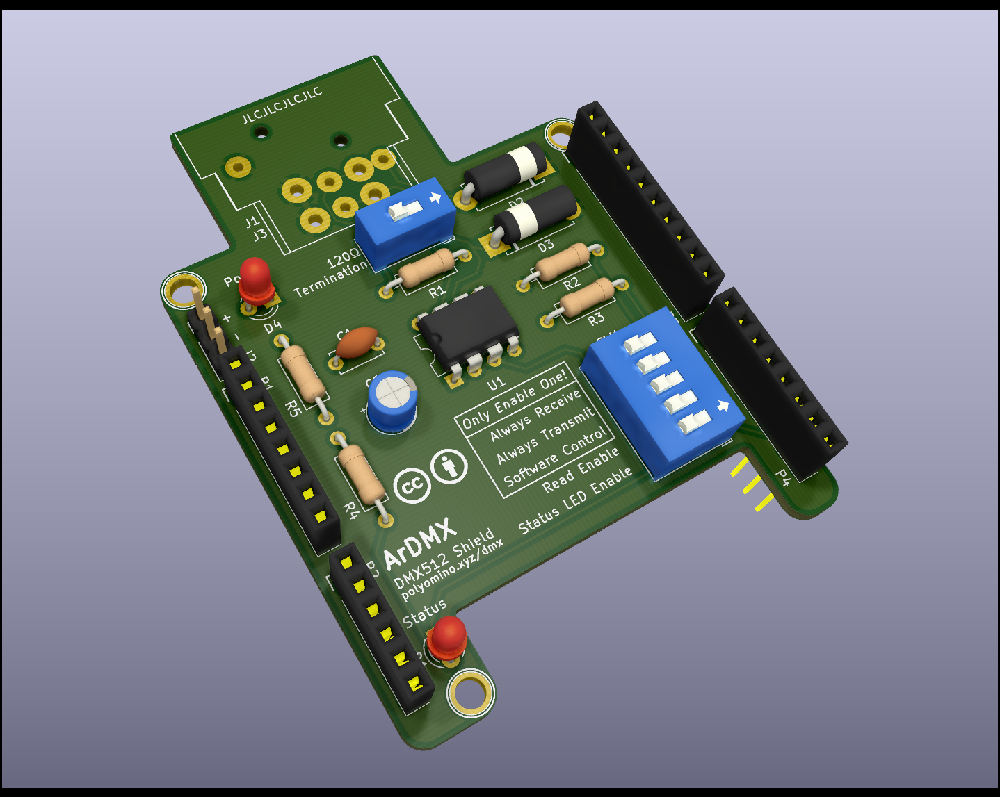

# ArDMX

*DMX512 Interface Shield*

## Introduction

Following the creation of [AVR-DMX](https://github.com/JMAlego/AVR-DMX) for Arduino, I decided that my first foray into circuit board design should be the creation of a shield to work with AVR-DMX to allow proper interfacing of an Arduino to a DMX network.

**NB**: I have yet to actually get one of these made so who knows if it works, it's based on a perfboarded design that works correctly though.

## DIP Switches

- 120Ω Termination:
- Mode (only enable one unless you want a short):
  - Always Receive: Pull-down
  - Always Transmit: Pull-up
  - Software Control: Connect to pin 2
- Read Enable: Connect read output to pin 8
- Status LED Enable: Connect status LED to pin 9

## Optional Components

- D2 & D3 are only required for max voltage clamping on the DMX bus, if you're not worried about over/under-voltage then don't bother with them.
- SW2 & R1 are optional if you don't want 120Ω termination.
- J2 is not required if you don't want to use the outputs without the XLR connector.
- J1 is not required if you plan to use J2 to connect to the DMX network.
- Smoothing caps C1 & C2 are also optional if you're sure your input supply will be sufficiently smooth.
- D4 & R5 are optional if you don't want the power LED.
- Similarly, D1 & R4 are optional if you don't want the status LED.

## Rough Costing

It should be possible to build for around £10 or less (though you may need to make a few). You'll find the most expensive part is the Neutrik NC5FAH-DA (or compatible) XLR 5-pin connector.

As of revision 1.1 a cheaper option of using the 3-pin XLR Neutrik NC3FAH1-DA connector which the board now also supports.

## License

Hardware designs are licensed under the [Creative Commons Attribution 4.0 International Licence](https://creativecommons.org/licenses/by/4.0/).
